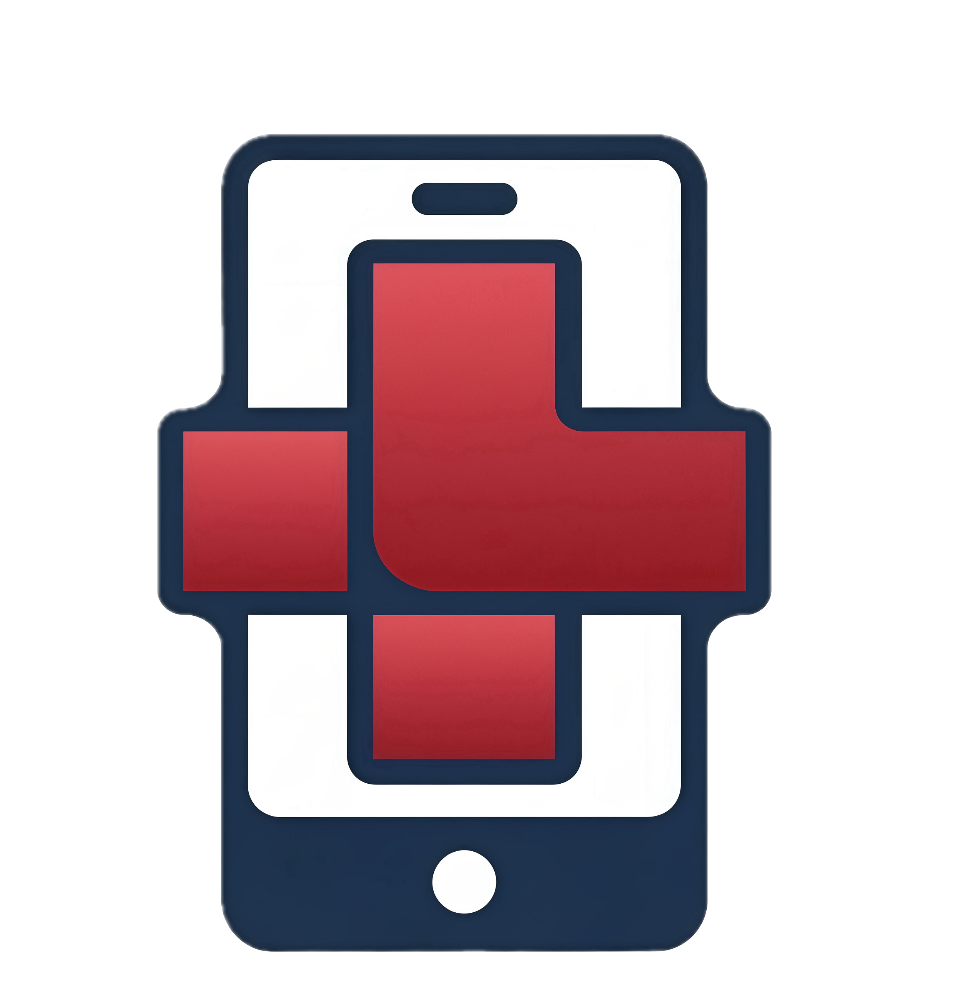

<div align="center">



# ResQ 🚑

> AI-powered emergency triage for the critical minutes before help arrives.


[](https://opensource.org/licenses/MIT)

**ResQ** is an AI emergency triage assistant designed for non-medical bystanders. When every second counts, it guides you through the right actions — calmly, clearly, and step by step.

**Workflow:** describe the emergency → AI triages the situation → receive real-time guidance → hand off to responders with a complete summary.

[Features](#-features) • [How It Works](#-how-it-works) • [Getting Started](#-getting-started) • [Roadmap](#-roadmap) • [Contributing](#-contributing)

</div>

---

## 🧭 Table of Contents

- [Features](#-features)
- [Why ResQ?](#-why-resq)
- [How It Works](#-how-it-works)
- [Emergency Cases](#-emergency-cases)
- [App Pages](#-app-pages)
- [Tech Stack](#-tech-stack)
- [Project Structure](#-project-structure)
- [Getting Started](#-getting-started)
- [Deployment](#-deployment)
- [Roadmap](#-roadmap)
- [Contributing](#-contributing)
- [Known Issues](#-known-issues)
- [Acknowledgments](#-acknowledgments)
- [License](#-license)

---

## ✨ Features

### For bystanders in an emergency

- 🗣 **Multi-modal input**
  - Type what you're seeing in plain language.
  - Use **voice mode** to describe the emergency hands-free.
  - Attach a **photo** directly from the chat to help the AI assess the situation.

- 🧠 **AI triage in real time**
  - Powered by **Gemini 2.5 Flash** via Google Cloud Vertex AI.
  - Identifies the emergency type and routes to the correct protocol.
  - Asks one focused follow-up question per turn — no overwhelming forms.
  - Detects red-flag symptoms and escalates to 911 guidance immediately.

- 📋 **Step-by-step protocol guidance**
  - Animated visual guides (CPR, Heimlich, bleeding control, stroke, chest pain).
  - Bold, bulleted instructions written for non-medical bystanders.
  - Tracks the current step and advances as the situation evolves.

- 🚨 **Responder handoff summary**
  - Automatically builds a structured summary of the incident.
  - Ready to read aloud when emergency services arrive.

- 📞 **Emergency contacts & quick dial**
  - One-tap calling for personal contacts and emergency numbers (911, Poison Control, Crisis 988).
  - "What to say" checklist so callers stay focused under stress.

- 👤 **Medical profile**
  - Patient's conditions, allergies, medications, and blood type available to the AI during triage.
  - Informs every response without the bystander needing to remember details.

---

## 🎯 Why ResQ?

In a medical emergency, most people freeze — not because they don't care, but because they don't know what to do next.

Common problems:
- ❌ Searching the internet during an emergency is slow, overwhelming, and unreliable.
- ❌ Generic first-aid guides aren't interactive and can't adapt to what's happening in front of you.
- ❌ Calling 911 without any guidance on what to do *while waiting* costs critical time.

**ResQ** acts as a calm, knowledgeable voice in the room — guiding bystanders through exactly the right actions, one step at a time, until professional help takes over.

---

## 🔄 How It Works

1. **Describe the emergency**
   Type, speak, or show a photo. No forms, no menus — just describe what you see.

2. **AI triages the situation**
   Gemini 2.5 Flash reads the input, identifies the most likely emergency type, and checks the patient's medical profile for relevant factors.

3. **Receive targeted guidance**
   The app shows a bold action, 2–4 supporting bullet points, and the animated visual protocol for the identified case.

4. **Keep the conversation going**
   As the situation changes, continue describing what's happening. The AI tracks context across the conversation and adjusts its guidance accordingly.

5. **Hand off to responders**
   When help arrives, the handoff summary gives responders an instant, structured overview of everything that happened.

---

## 🩺 Emergency Cases

ResQ handles five high-priority emergency categories plus a general fallback:

| Case | Trigger signals | Key guidance |
|------|----------------|--------------|
| 🫀 **Not Breathing / CPR** | Unconscious, not breathing, gasping, collapsed | Hands-only CPR, 100–120 compressions/min |
| 🫁 **Choking** | Can't speak, can't breathe, airway blockage | 5 back blows → 5 abdominal thrusts |
| 🩸 **Severe Bleeding** | Heavy bleeding, blood soaking through | Direct firm pressure, do not lift cloth |
| 🧠 **Stroke** | Slurred speech, face droop, one-sided weakness | Note symptom onset time, call 911, no oral medication |
| 💔 **Chest Pain** | Crushing chest pain, spreading to arm/jaw, sweating | Stop activity, rest, call 911 |
| ❓ **Other / Unknown** | Unclassified symptoms | Stabilize, gather more detail, escalate if worsening |

Each case has:
- A dedicated **animated visual guide** (GIF).
- A full **step-by-step protocol**.
- **Do not** warnings for common dangerous mistakes.

---

## 🖼 App Pages

### 🚨 Emergency (Triage)

The main interface. Two modes:

**Intake mode** — before a case is identified:
- Quick-select emergency type pills (CPR, Choking, Bleeding, Stroke, Chest Pain).
- Text, voice, or camera input.
- AI starts triage immediately on first message.

**Action mode** — once a case is active:
- Left column: live chat with the AI, plus camera toggle.
- Right column: animated protocol GIF, responder handoff summary, back button.
- Call banner displayed if the AI determines 911 should be called now.

### 👤 Profile

Patient's medical profile:
- Name, age, blood type.
- Conditions, allergies, and current medications.
- Emergency contact information.

All of this is passed to the AI on every triage turn.

### 📞 Contacts

Emergency contacts page:
- Personal contact card with one-tap calling.
- "What to say" checklist for callers under stress.
- Quick-dial panel: 911, Poison Control (800-222-1222), Crisis Helpline (988), Non-Emergency (311).
- "Before you call" tips for staying clear and effective.

### 📚 Learn

Reference guide for all five emergency protocols:
- Tab-based navigation per case.
- Step-by-step instructions with numbered steps.
- "Do not" warning section for each case.
- Animated GIF demonstrations.

---

## 🧱 Tech Stack

- **Language:** Python 3.10
- **UI:** Streamlit (wide layout, custom CSS design system)
- **AI Model:** Google Gemini 2.5 Flash via Vertex AI (`google-genai`)
- **Voice Input:** Streamlit `st.audio_input` → Gemini transcription
- **Image Input:** Streamlit `st.camera_input` → multimodal Gemini prompt
- **Logging / Analytics:** Google Cloud BigQuery (`google-cloud-bigquery`)
- **Deployment:** Docker + Google Cloud Run
- **Styling:** Custom CSS design token system (Inter font, neutral palette, brand yellow)

---

## 🗂 Project Structure

```text
resQ/
├── app.py                  # Main Streamlit app — routing, state, triage loop
├── modules.py              # UI components: nav, cards, contacts, animations
├── vertex_helper.py        # Gemini API calls: triage_turn(), transcribe_audio()
├── emergency_content.py    # System prompt, case protocols, FAST hints, demo profile
├── db.py                   # BigQuery logging (sessions + messages)
├── styles.css              # Full design system — tokens, layout, components
├── requirements.txt        # Python dependencies
├── Dockerfile              # Container definition (Python 3.10, port 8080)
├── run-streamlit.sh        # Local run helper
├── setup.sh                # Environment setup script
└── assets/
    └── animations/
        ├── logo.png        # App logo (used as AI avatar in chat)
        ├── cpr.gif         # CPR / not breathing animation
        ├── choking.gif     # Choking / Heimlich animation
        ├── bleeding.gif    # Severe bleeding animation
        ├── stroke.gif      # Stroke animation
        └── chest_pain.gif  # Chest pain / heart attack animation
```

---

## 🚀 Getting Started

### Prerequisites

- Python 3.10+
- A Google Cloud project with:
  - **Vertex AI API** enabled
  - **Gemini 2.5 Flash** available in your region
  - **BigQuery** dataset (optional — logging gracefully degrades without it)
  - Application Default Credentials configured (`gcloud auth application-default login`)

### Local setup

```bash
# Clone the repository
git clone https://github.com/your-username/resQ.git
cd resQ

# Install dependencies
pip install -r requirements.txt

# Run the app
streamlit run app.py
```

The app will open at `http://localhost:8501`.

> **Note:** Set your Google Cloud project in `vertex_helper.py` (`PROJECT_ID`) and `db.py` (`PROJECT_ID`) before running.

### Environment (alternative)

```bash
# Use the provided helper
bash setup.sh
bash run-streamlit.sh
```

---

## 🐳 Deployment

ResQ is containerized and designed for **Google Cloud Run**.

### Build and run with Docker

```bash
# Build the image
docker build -t resq .

# Run locally
docker run -p 8080:8080 resq
```

### Deploy to Cloud Run

```bash
# Build and push to Artifact Registry
gcloud builds submit --tag gcr.io/YOUR_PROJECT_ID/resq

# Deploy
gcloud run deploy resq \
  --image gcr.io/YOUR_PROJECT_ID/resq \
  --platform managed \
  --region us-central1 \
  --allow-unauthenticated \
  --port 8080
```

> The app exposes **port 8080** as defined in the `Dockerfile`. Cloud Run routes traffic there automatically.

---

## 🛣 Roadmap

Planned and possible future work:

- [ ] 🔐 Real user authentication and persistent medical profiles.
- [ ] 🌍 Multi-language support for triage and guidance.
- [ ] 📱 Mobile-optimized layout and PWA support.
- [ ] 🔊 Text-to-speech for AI guidance (hands-free mode).
- [ ] 📊 Session analytics dashboard for understanding common emergencies.
- [ ] 🏥 Integration with local emergency services APIs.
- [ ] 🧪 Offline fallback mode with cached protocols.
- [ ] 👨‍⚕️ Clinician review mode for verifying AI guidance quality.

Track progress via GitHub Issues.

---

## 🤝 Contributing

Contributions are welcome — especially improvements to triage logic, UI clarity, and accessibility.

1. **Fork** this repository.

2. Create a feature branch:
   ```bash
   git checkout -b feature/my-improvement
   ```

3. Make your changes and commit:
   ```bash
   git commit -m "Add my improvement"
   ```

4. Push your branch:
   ```bash
   git push origin feature/my-improvement
   ```

5. Open a **Pull Request** with a clear description of what you changed and why.

---

## 🐛 Known Issues

- AI responses depend on Vertex AI availability — network errors fall back to hardcoded contextual responses.
- Voice transcription quality degrades with background noise.
- Camera input works best in well-lit conditions; dark or blurry images reduce AI accuracy.
- BigQuery logging silently no-ops if credentials are unavailable — triage still works normally.
- The demo profile (Maria Rivera) is hardcoded; real profile persistence requires authentication.

Please report issues via GitHub Issues.

---

## 🙏 Acknowledgments

- [Google Gemini](https://deepmind.google/technologies/gemini/) for the multimodal AI model powering triage.
- [Google Cloud Vertex AI](https://cloud.google.com/vertex-ai) for the inference API.
- [Streamlit](https://streamlit.io/) for the rapid web app framework.
- [Google ML Kit](https://developers.google.com/ml-kit) design philosophy — on-device, fast, accessible AI.
- First responders and emergency medicine professionals whose protocols informed the guidance content.

---

## 📜 License

```text
MIT License

Copyright (c) 2025 Saurab Gyawali

Permission is hereby granted, free of charge, to any person obtaining a copy
of this software and associated documentation files (the "Software"), to deal
in the Software without restriction, including without limitation the rights
to use, copy, modify, merge, publish, distribute, sublicense, and/or sell
copies of the Software, and to permit persons to whom the Software is
furnished to do so, subject to the following conditions:

The above copyright notice and this permission notice shall be included in all
copies or substantial portions of the Software.

THE SOFTWARE IS PROVIDED "AS IS", WITHOUT WARRANTY OF ANY KIND, EXPRESS OR
IMPLIED, INCLUDING BUT NOT LIMITED TO THE WARRANTIES OF MERCHANTABILITY,
FITNESS FOR A PARTICULAR PURPOSE AND NONINFRINGEMENT. IN NO EVENT SHALL THE
AUTHORS OR COPYRIGHT HOLDERS BE LIABLE FOR ANY CLAIM, DAMAGES OR OTHER
LIABILITY, WHETHER IN AN ACTION OF CONTRACT, TORT OR OTHERWISE, ARISING FROM,
OUT OF OR IN CONNECTION WITH THE SOFTWARE OR THE USE OR OTHER DEALINGS IN THE
SOFTWARE.
```

---

<div align="center">

**Built for the moments that matter most.**

[⬆ Back to Top](#resq-)

</div>
